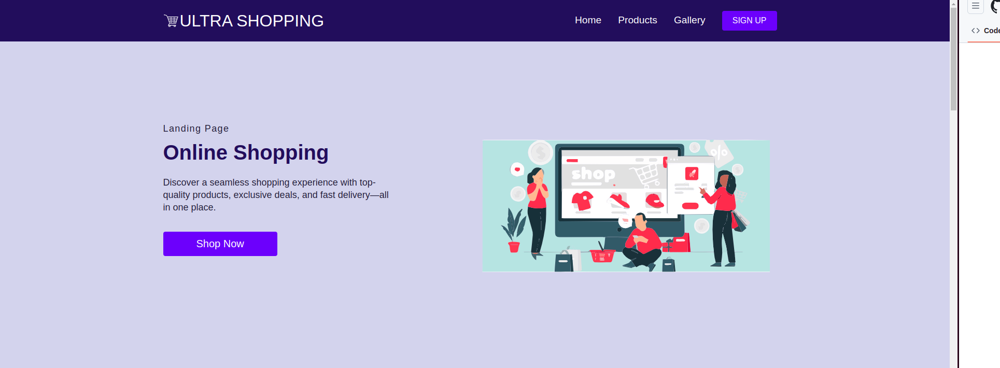
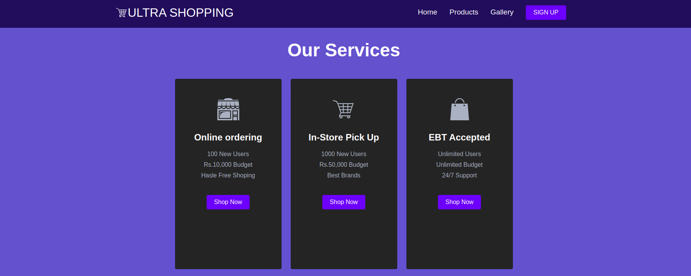
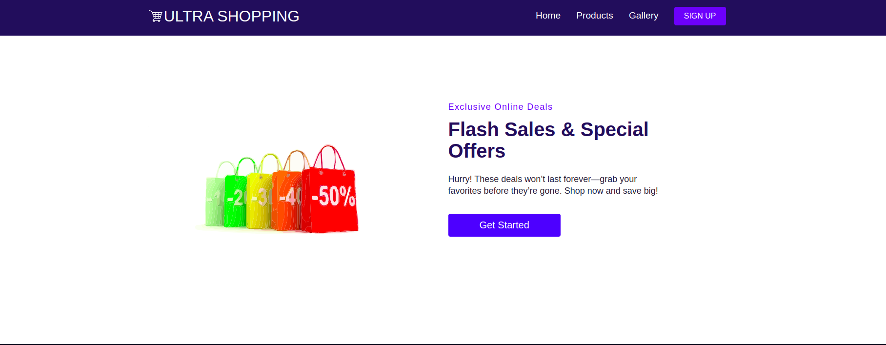

# React_Single_Page_Website

 # **Description**
This project is a single-page React application built to explore the fundamentals of React.js, state management, and routing. It consists of multiple sections and navigation functionality.
This project is a single-page website built using React.js, demonstrating React Router, state management, and styled components. It consists of a smooth navigation bar, multiple pages, and a responsive UI optimized for desktop and mobile users.
This project serves as a learning exercise to get familiar with React fundamentals, including component structuring, props, hooks, and routing.

# Pages & Functionality
Navbar: A responsive navigation menu with links to different pages.

Home Page: Landing page with a clean UI and SVG elements.

Services Page: Displays services with box-shadow effects.

Gallery Page: Section for showcasing products.

Sign-Up (Placeholder): Clicking on Sign-Up redirects users to the footer (no authentication applied).

# Features
Smooth Scrolling – Seamless navigation across sections.

Fully Responsive Design – Mobile-friendly with a hamburger menu for small screens.

React Router Navigation – Enables page switching without reloading.

SVG Integration – High-quality visuals for a modern look.

Styled Components – Custom styling for better UI/UX.

Footer with Mailing List & Navigation Links – Provides additional resources and a call to action.

# Tech Stack
⚛️ React.js – JavaScript library for UI development

📜 JavaScript (ES6+) – Core scripting language

🌍 React Router – For client-side routing

🎨 Styled-Components – CSS-in-JS for better styling

🔗 React Icons – For aesthetic UI elements

📌 Google Fonts – Enhancing typography

#  Project Structure
php
Copy
Edit
React_Single_Page_Website/
│── public/                 # Static assets
│── src/                    # Source code
│   ├── components/         # Reusable UI components
│   ├── pages/              # Page components
│   ├── App.js              # Main React component
│   ├── index.js            # Entry point
│── .gitignore              # Files to ignore in Git
│── package.json            # Project dependencies
│── README.md               # Project documentation

# **Images** :- 

